# Complete DFD Level 0 to Level 4 Analysis

## 1. Codebase Scope Reviewed

### Folders and files inspected
- package.json
- prisma/schema.prisma
- src/proxy.ts
- src/lib/auth.ts
- src/lib/rbac.ts
- src/lib/prisma.ts
- src/lib/db.ts
- src/lib/applications.ts
- src/lib/document-storage.ts
- src/lib/bplo-applications.ts
- src/lib/bplo-assessment.ts
- src/lib/fee-computation.ts
- src/lib/bplo-payment-verification.ts
- src/lib/bplo-permit-issuance.ts
- src/lib/business-location.ts
- src/lib/jit-inspections.ts
- src/lib/department-head-api.ts
- src/lib/superadmin-data.ts
- src/lib/audit-log.ts
- src/lib/sms.ts
- src/lib/fee-settings.ts
- src/lib/printable-documents.ts
- src/app/api/** (applicant, auth, bplo, department-head, jit, superadmin, permits, address)

### Frameworks/tools detected
- Next.js App Router (next 16)
- NextAuth v5 (credentials + Google OAuth)
- Prisma ORM (sqlite provider, libsql adapter)
- React 19
- Tailwind CSS
- Vitest

### Database/storage/auth integrations detected
- SQLite via Prisma
- Local file storage on server filesystem: .uploads/applicant-documents
- NextAuth JWT session strategy
- Google OAuth provider in NextAuth
- CountryStateCity API (country/state/city lists)
- PSGC API (barangays)
- OpenStreetMap Nominatim (reverse geocode)
- SMS providers: Twilio or Semaphore (env-driven)

## 2. External Entities

| Entity ID | Entity Name | Description | Evidence from codebase |
|---|---|---|---|
| E1 | Applicant | Registers, signs in, files NEW/RENEWAL/CLOSURE applications, uploads documents, submits OR/proof, views permit/certificate | src/app/api/auth/register/route.ts, src/app/api/applicant/applications/route.ts, src/app/api/applicant/top/route.ts, src/app/api/permits/[applicationId]/route.ts |
| E2 | BPLO Officer | Reviews applications, transitions status, computes fees, generates TOP, verifies payments, prepares/releases permit, verifies map points | src/app/api/bplo/applications/[applicationId]/under-review/route.ts, src/app/api/bplo/assessment-fees/[applicationId]/generate-top/route.ts, src/app/api/bplo/payment-verification/[paymentReferenceId]/approve/route.ts, src/app/api/bplo/permit-issuance/[applicationId]/release/route.ts |
| E3 | Department Head | Approves/rejects/returns DH review queue, verifies JIT inspections, decides revocations, settles revoked records | src/app/api/department-head/application-approval/[applicationId]/approve/route.ts, src/app/api/department-head/inspection-verification/[inspectionId]/verify/route.ts, src/app/api/department-head/permit-to-revoke/[inspectionId]/approve-revocation/route.ts, src/app/api/department-head/revoke-permit-list/[inspectionId]/mark-settled/route.ts |
| E4 | JIT Inspector | Submits compliance/non-compliance inspections with evidence | src/app/api/jit/inspect-a-business/[businessRecordId]/route.ts, src/lib/jit-inspections.ts |
| E5 | Super Admin | Monitors reports/activities, manages users, fee settings, extension windows | src/app/api/superadmin/activities/route.ts, src/app/api/superadmin/reports/route.ts, src/app/api/superadmin/users/[userId]/disable/route.ts, src/app/api/superadmin/settings/fees/route.ts |
| E6 | Google OAuth | Optional social login identity provider | src/lib/auth.ts |
| E7 | CountryStateCity API | Provides countries/states/cities for address form options | src/app/api/address/countries/route.ts, src/app/api/address/states/route.ts, src/app/api/address/cities/route.ts |
| E8 | PSGC API | Provides barangay data for PH addresses | src/app/api/address/barangays/route.ts |
| E9 | OpenStreetMap Nominatim | Reverse geocodes map pin to address | src/app/api/address/reverse-geocode/route.ts |
| E10 | SMS Provider (Twilio/Semaphore) | Sends FOR_RELEASE/RELEASED SMS notices | src/lib/sms.ts |

## 3. Data Stores

| Data Store ID | Data Store Name | Related Prisma model/table/storage bucket | Purpose | Evidence from codebase |
|---|---|---|---|---|
| D1 | User Store | User | Accounts, roles, active state, auth subject | prisma/schema.prisma, src/lib/auth.ts, src/lib/db.ts |
| D2 | Application Store | BusinessApplication | Main workflow state + formData JSON | prisma/schema.prisma, src/lib/applications.ts |
| D3 | Business Registry Store | BusinessRecord | Permit-bearing business master record and status ACTIVE/INACTIVE/CLOSED | prisma/schema.prisma, src/lib/bplo-permit-issuance.ts |
| D4 | Document Metadata Store | ApplicationDocument | Metadata pointers for uploaded files | prisma/schema.prisma, src/lib/applications.ts |
| D5 | File Storage | Local filesystem (.uploads/applicant-documents) | Binary files for application docs, OR proof, inspection evidence | src/lib/document-storage.ts |
| D6 | Workflow History Store | ApplicationHistory | Status transitions and remarks timeline | prisma/schema.prisma, src/lib/bplo-applications.ts, src/lib/department-head-api.ts |
| D7 | Assessment Store | FeeAssessment, FeeAssessmentLineItem | TOP numbers, component fees, balances, payment frequency | prisma/schema.prisma, src/lib/bplo-assessment.ts |
| D8 | Payment Reference Store | PaymentReference | OR number, proof metadata, verification status | prisma/schema.prisma, src/lib/applications.ts, src/lib/bplo-payment-verification.ts |
| D9 | Permit Issuance Store | PermitIssuance | Permit/certificate numbering, prepared/released status | prisma/schema.prisma, src/lib/bplo-permit-issuance.ts |
| D10 | Location Store | BusinessLocation | Coordinates + verification lifecycle for mapped businesses | prisma/schema.prisma, src/lib/business-location.ts |
| D11 | Inspection Store | Inspection | JIT findings, DH verification, revocation states and evidence metadata | prisma/schema.prisma, src/lib/jit-inspections.ts, src/lib/department-head-api.ts |
| D12 | Fee Config Store | FeeConfigurationItem, SystemFeeSetting, RenewalExtension | Runtime fee overrides, penalties, extension windows | prisma/schema.prisma, src/lib/fee-settings.ts |
| D13 | Audit Store | AuditLog | Cross-module auditable activity trail | prisma/schema.prisma, src/lib/audit-log.ts |
| D14 | SMS Log Store | SmsDeliveryLog | Sent/failed/skipped SMS auditability | prisma/schema.prisma, src/lib/sms.ts |

## 4. Level 0 Context Diagram

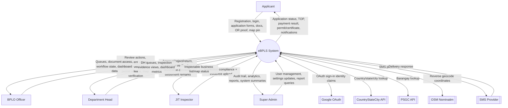

### Explanation
- External identities are all role actors plus third-party services actually called from routes/libs.
- Major flows cover input (forms/files/actions), processing (validation/business rules), and output (statuses/reports/files/SMS).

## 5. Level 1 System DFD

```mermaid
flowchart TD
  E1[Applicant]
  E2[BPLO Officer]
  E3[Department Head]
  E4[JIT Inspector]
  E5[Super Admin]
  S1[[Third-party APIs and SMS]]

  P1((Auth and Session Control))
  P2((Applicant Application and Document Submission))
  P3((BPLO Review and Transition))
  P4((Fee Assessment and TOP Generation))
  P5((Payment Reference Submission and Verification))
  P6((Permit/Certificate Issuance and Release))
  P7((Business Location and Map Verification))
  P8((JIT Inspection and DH Revocation Workflow))
  P9((Super Admin Audit/Reports/Settings))

  D1[(User)]
  D2[(BusinessApplication)]
  D3[(BusinessRecord)]
  D4[(ApplicationDocument)]
  D5[(Local File Storage)]
  D6[(ApplicationHistory)]
  D7[(FeeAssessment + LineItems)]
  D8[(PaymentReference)]
  D9[(PermitIssuance)]
  D10[(BusinessLocation)]
  D11[(Inspection)]
  D12[(Fee Settings/Extensions)]
  D13[(AuditLog)]
  D14[(SmsDeliveryLog)]

  E1 --> P1
  E2 --> P1
  E3 --> P1
  E4 --> P1
  E5 --> P1
  P1 <--> D1

  E1 --> P2
  P2 <--> D2
  P2 <--> D4
  P2 <--> D5
  P2 --> D6

  E2 --> P3
  P3 <--> D2
  P3 --> D6

  E2 --> P4
  P4 <--> D2
  P4 <--> D7
  P4 <--> D12
  P4 --> D6

  E1 --> P5
  E2 --> P5
  P5 <--> D2
  P5 <--> D7
  P5 <--> D8
  P5 <--> D5
  P5 --> D6

  E2 --> P6
  P6 <--> D2
  P6 <--> D3
  P6 <--> D9
  P6 <--> D10
  P6 --> D6
  P6 --> D14
  P6 <--> S1

  E1 --> P7
  E2 --> P7
  E4 --> P7
  P7 <--> D10
  P7 <--> D3
  P7 <--> D2

  E4 --> P8
  E3 --> P8
  P8 <--> D11
  P8 <--> D2
  P8 <--> D3
  P8 <--> D5
  P8 --> D6

  E5 --> P9
  P9 <--> D1
  P9 <--> D2
  P9 <--> D3
  P9 <--> D7
  P9 <--> D11
  P9 <--> D12
  P9 <--> D13
  P9 <--> D14

  P2 --> D13
  P3 --> D13
  P5 --> D13
  P6 --> D13
  P8 --> D13
  P9 --> D13
```

### Level 1 process table

| Process ID | Process Name | Purpose | Main files/routes | Data stores/models used | External entities involved |
|---|---|---|---|---|---|
| P1 | Auth and Session Control | Authenticate users, enforce role path boundaries and API role checks | src/lib/auth.ts, src/proxy.ts, src/lib/rbac.ts, src/app/api/auth/register/route.ts | User | Applicant, BPLO, Department Head, JIT, Super Admin, Google OAuth |
| P2 | Applicant Application and Document Submission | Save/submit NEW/RENEWAL/CLOSURE, validate, store docs | src/app/api/applicant/applications/route.ts, src/lib/applications.ts, src/app/api/applicant/applications/[applicationId]/documents/route.ts, src/lib/document-storage.ts | BusinessApplication, ApplicationDocument, ApplicationHistory, local files | Applicant |
| P3 | BPLO Review and Transition | Move review queue states and capture remarks | src/lib/bplo-applications.ts, src/app/api/bplo/applications/* | BusinessApplication, ApplicationHistory | BPLO |
| P4 | Fee Assessment and TOP Generation | Compute fees, save draft, generate TOP and transition to APPROVED_FOR_PAYMENT | src/lib/bplo-assessment.ts, src/lib/fee-computation.ts, src/lib/fee-settings.ts, src/app/api/bplo/assessment-fees/* | BusinessApplication, FeeAssessment, FeeAssessmentLineItem, ApplicationHistory, FeeConfigurationItem, SystemFeeSetting, RenewalExtension | BPLO |
| P5 | Payment Reference Submission and Verification | Applicant submits OR + proof, BPLO verifies/rejects | src/app/api/applicant/top/route.ts, src/lib/applications.ts, src/app/api/bplo/payment-verification/*, src/lib/bplo-payment-verification.ts | BusinessApplication, PaymentReference, FeeAssessment, ApplicationHistory, local files | Applicant, BPLO |
| P6 | Permit/Certificate Issuance and Release | Prepare/release permit/closure certificate, update business status/record, trigger SMS | src/lib/bplo-permit-issuance.ts, src/app/api/bplo/permit-issuance/*, src/lib/sms.ts | PermitIssuance, BusinessApplication, BusinessRecord, BusinessLocation, SmsDeliveryLog, ApplicationHistory | BPLO, SMS Provider |
| P7 | Business Location and Map Verification | Persist pin locations and verify/return by BPLO, list for BPLO/JIT maps | src/lib/business-location.ts, src/app/api/bplo/business-map/*, src/app/api/jit/business-map/route.ts, src/app/api/applicant/business-location/* | BusinessLocation, BusinessRecord, BusinessApplication | Applicant, BPLO, JIT |
| P8 | JIT Inspection and DH Revocation Workflow | JIT submits inspection evidence, DH verifies, revocation decision applied | src/lib/jit-inspections.ts, src/lib/department-head-api.ts, src/app/api/jit/inspect-a-business/[businessRecordId]/route.ts, src/app/api/department-head/* | Inspection, BusinessApplication, BusinessRecord, ApplicationHistory, local files | JIT, Department Head |
| P9 | Super Admin Audit/Reports/Settings | Read reports, activities, manage users and fee settings | src/lib/superadmin-data.ts, src/lib/audit-log.ts, src/lib/fee-settings.ts, src/app/api/superadmin/* | AuditLog, User, BusinessApplication, FeeAssessment, Inspection, SmsDeliveryLog, Fee config tables | Super Admin |

## 6. Level 2 Module DFDs

### Module 6.1 Authentication and role-based access
Parent Level 1 process: P1
Status: Found

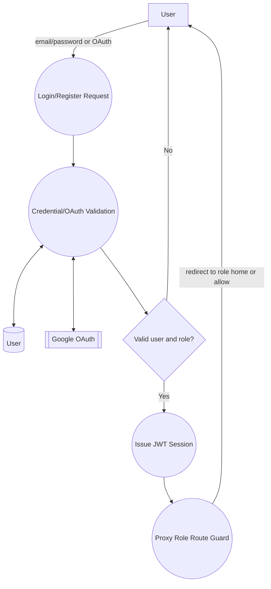

Subprocess summary
- Registration validates email/mobile/password and forces APPLICANT role.
- Login uses credentials bcrypt compare or Google OAuth upsert.
- Session token stores id + role.
- Proxy guard enforces route/role boundaries.

Code evidence

| File path | Function/API/handler/component/service | What data flow it proves |
|---|---|---|
| src/app/api/auth/register/route.ts | POST | Registration input validation + user write |
| src/lib/auth.ts | NextAuth config (authorize, callbacks) | Credentials/OAuth validation + session token shaping |
| src/proxy.ts | proxy middleware | Route-level session and role guard redirects |
| src/lib/rbac.ts | canAccess/isProtectedRoute | Role-route access control matrix |

### Module 6.2 Application submission (NEW/RENEWAL/CLOSURE)
Parent Level 1 process: P2
Status: Found

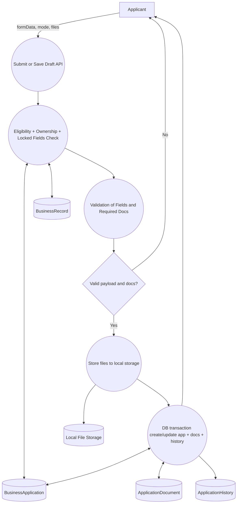

Subprocess summary
- Applies locked fields for renewal, verifies eligibility and uniqueness (reg no + TIN).
- Validates format/rules: PH mobile, email, age/birthDate, EB Magalona geofence, required docs.
- On SUBMIT mode, writes files first, then DB transaction writes application/doc/history.
- On failure, attempts file cleanup.

Code evidence

| File path | Function/API/handler/component/service | What data flow it proves |
|---|---|---|
| src/app/api/applicant/applications/route.ts | POST | Entry point for draft/submit with multipart files |
| src/lib/applications.ts | saveApplicantApplication | Core submission orchestration and writes |
| src/lib/applications.ts | validateSubmitPayload | Field/doc/business rule validation gates |
| src/lib/document-storage.ts | storeApplicantDocument/removeApplicantDocument | File persistence and rollback cleanup |

### Module 6.3 Fee assessment and TOP generation
Parent Level 1 process: P4
Status: Found

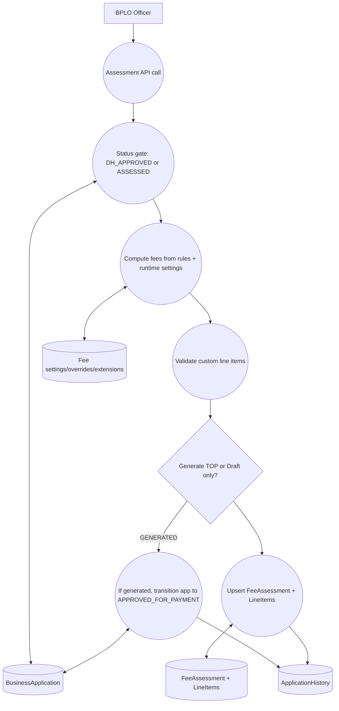

Subprocess summary
- Uses fee-computation classification tables and runtime overrides.
- Enforces applicant-selected payment frequency.
- Draft and generated modes share persistence path.
- Generated TOP transitions application to APPROVED_FOR_PAYMENT.

Code evidence

| File path | Function/API/handler/component/service | What data flow it proves |
|---|---|---|
| src/app/api/bplo/assessment-fees/[applicationId]/generate-top/route.ts | POST | API entry and payload contract |
| src/lib/bplo-assessment.ts | persistAssessment/generateTop | Assessment transaction + status transition |
| src/lib/fee-computation.ts | computeMayorsPermitFee | Rule-driven fee computation |
| src/lib/fee-settings.ts | getRuntimeFeeSettings | Dynamic configuration and extension effects |

### Module 6.4 Payment submission and verification (OR)
Parent Level 1 process: P5
Status: Found

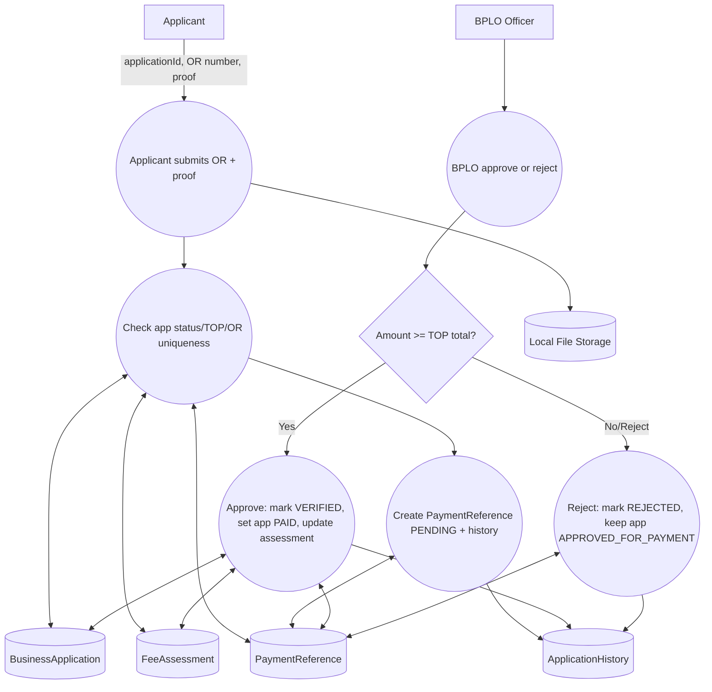

Subprocess summary
- Applicant submits OR proof only after generated TOP and APPROVED_FOR_PAYMENT state.
- Global OR uniqueness enforced by DB unique key and pre-check.
- BPLO approval requires paid amount not below TOP total.

Code evidence

| File path | Function/API/handler/component/service | What data flow it proves |
|---|---|---|
| src/app/api/applicant/top/route.ts | POST | Applicant payment reference intake with proof file |
| src/lib/applications.ts | submitApplicantPaymentReference | Pending payment reference create and checks |
| src/app/api/bplo/payment-verification/[paymentReferenceId]/approve/route.ts | POST | BPLO verification endpoint |
| src/lib/bplo-payment-verification.ts | approvePaymentReference/rejectPaymentReference | Approval/rejection state and amount checks |

### Module 6.5 Permit release and business activation/closure
Parent Level 1 process: P6
Status: Found

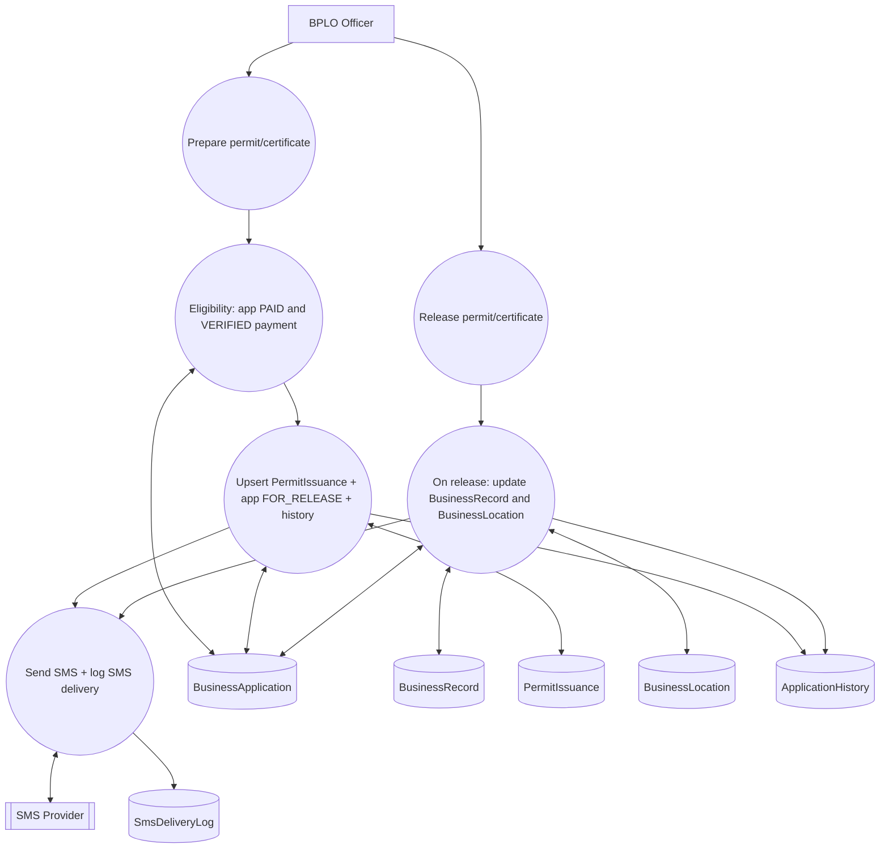

Subprocess summary
- Prepare step moves PAID -> FOR_RELEASE and creates/updates issuance number.
- Release step moves FOR_RELEASE -> RELEASED and updates business record:
  - NEW/RENEWAL: activates/upserts BusinessRecord.
  - CLOSURE: soft-closes BusinessRecord (status CLOSED, closedAt, closureApplicationId).
- SMS is attempted and logged regardless of send success.

Code evidence

| File path | Function/API/handler/component/service | What data flow it proves |
|---|---|---|
| src/app/api/bplo/permit-issuance/[applicationId]/prepare/route.ts | POST | Prepare endpoint |
| src/lib/bplo-permit-issuance.ts | preparePermitIssuance | Prepare checks + issuance write + FOR_RELEASE transition |
| src/lib/bplo-permit-issuance.ts | releasePermitIssuance/upsertBusinessRecordOnRelease | Release transition + business lifecycle update |
| src/lib/sms.ts | sendReleaseStatusSms | SMS send + delivery log persistence |

### Module 6.6 JIT + Department Head inspection and revocation
Parent Level 1 process: P8
Status: Found

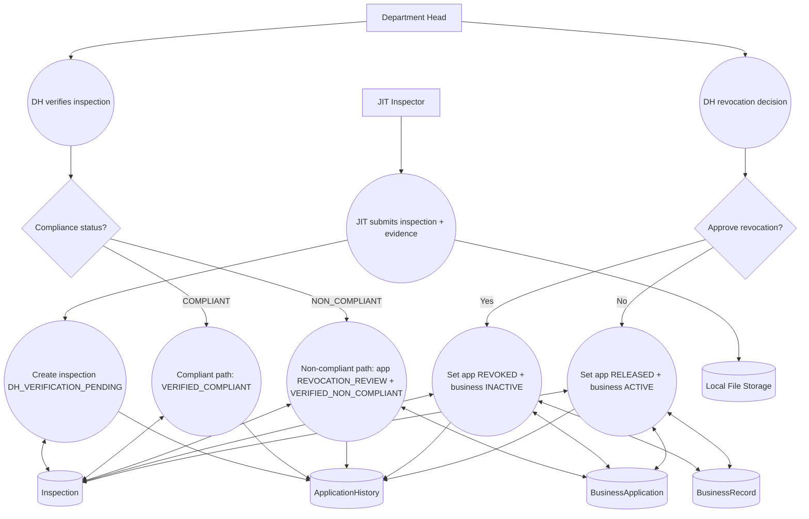

Subprocess summary
- JIT must submit comment and evidence.
- DH cannot verify own JIT submission.
- Non-compliant verified cases enter revocation review.
- Revocation approval inactivates business and marks application REVOKED.

Code evidence

| File path | Function/API/handler/component/service | What data flow it proves |
|---|---|---|
| src/app/api/jit/inspect-a-business/[businessRecordId]/route.ts | POST | JIT submission entry with evidence upload |
| src/lib/jit-inspections.ts | createJitInspection | Inspection write + history |
| src/app/api/department-head/inspection-verification/[inspectionId]/verify/route.ts | POST | DH verify endpoint |
| src/lib/department-head-api.ts | applyDepartmentHeadInspectionVerification/applyDepartmentHeadRevocationDecision | Revocation decision transitions |

### Module 6.7 Admin reporting/audit/settings
Parent Level 1 process: P9
Status: Found

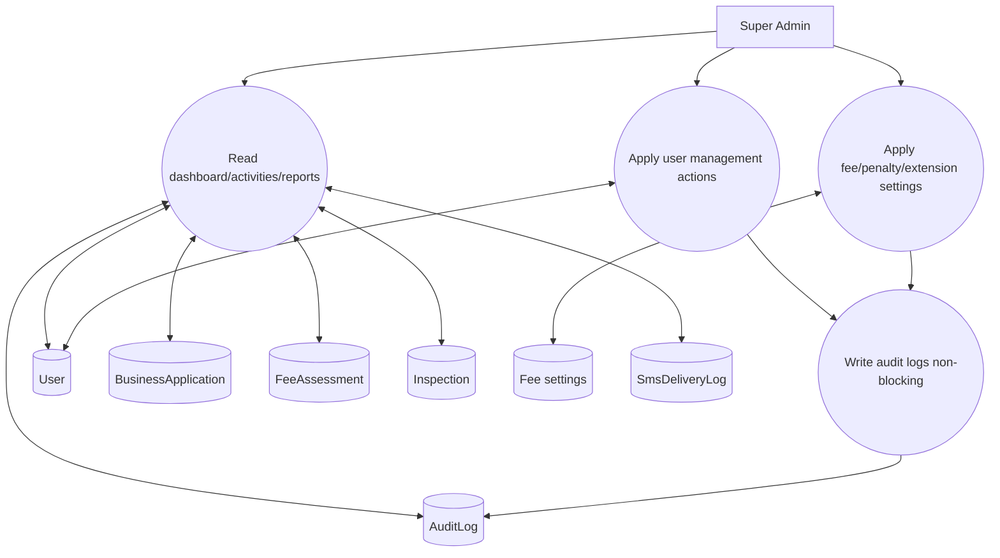

Subprocess summary
- Super Admin can read broad analytics and activity logs.
- User management supports disable/reactivate/reset password.
- Fee settings and extension windows are mutable with validations.
- Audit writes are best-effort and non-blocking.

Code evidence

| File path | Function/API/handler/component/service | What data flow it proves |
|---|---|---|
| src/app/api/superadmin/activities/route.ts | GET | Activity feed read path |
| src/lib/superadmin-data.ts | get*Report/list* functions | Report/query data extraction |
| src/app/api/superadmin/users/[userId]/disable/route.ts | POST | User lifecycle control |
| src/lib/audit-log.ts | createAuditLog | Non-blocking audit persistence |

## 7. Level 3 Critical Process DFDs

### Level 3-A: Applicant submission validation and persistence boundary
Parent Level 2 process: Module 6.2

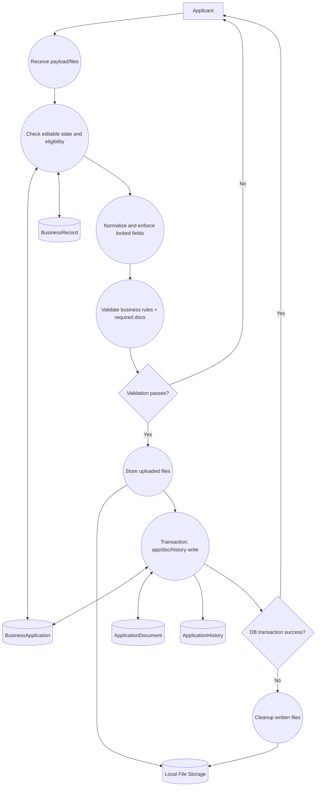

Validation and decision table

| Checkpoint | Condition | Failure behavior | Success behavior |
|---|---|---|---|
| Session/role | Applicant session required | 401 | Continue |
| Eligibility | Renewal/closure needs eligible business record | Error 400/403/409 | Continue |
| Geofence | NEW/RENEWAL requires pin inside EB Magalona | Validation error | Continue |
| Identity uniqueness | registrationNumber + TIN not duplicate (records + JSON query) | Duplicate error | Continue |
| Required fields/docs | Missing fields/docs blocked on submit | SubmitValidationError | Continue |
| File constraints | MIME/size checked before writing | Error, no DB write | Continue |
| Editable lock | Non-editable statuses rejected | Error | Continue |

Status transition table

| From | To | Trigger |
|---|---|---|
| null | DRAFT | new draft save |
| null | SUBMITTED | new submit |
| DRAFT or RETURNED_FOR_CORRECTION | SUBMITTED | applicant resubmit |
| editable status | DRAFT | draft update |

Risk notes
- File write occurs before DB transaction for submit mode. Cleanup exists but hard failures can still leave orphan files (partial risk).
- JSON query checks for duplicate identity rely on SQLite json_extract behavior and status filtering; cross-db portability risk.

### Level 3-B: Payment verification and OR uniqueness
Parent Level 2 process: Module 6.4

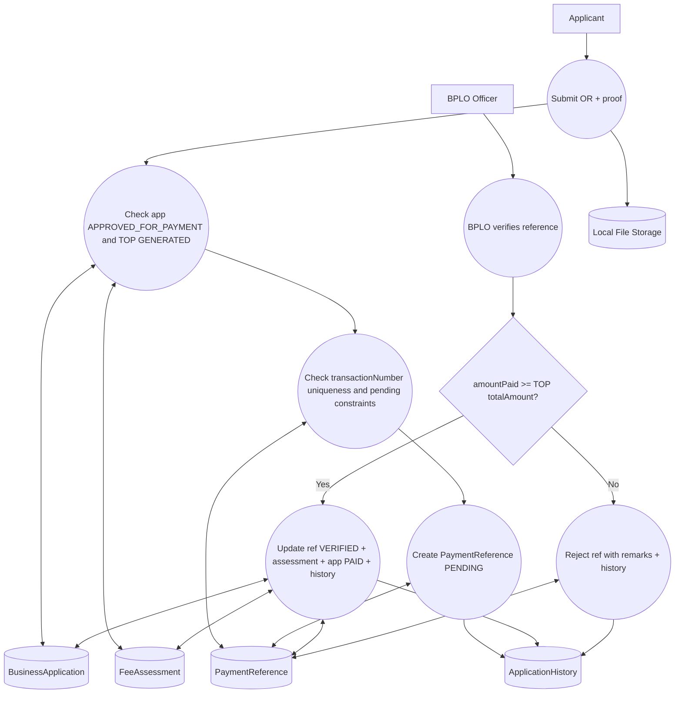

Validation and decision table

| Checkpoint | Condition | Failure behavior | Success behavior |
|---|---|---|---|
| Applicant payment intake | Requires applicationId, OR number, proof file | 400 | Continue |
| Workflow gate | app must be APPROVED_FOR_PAYMENT + generated TOP | Error | Continue |
| OR uniqueness | transactionNumber unique globally | Error duplicate | Continue |
| Outstanding pending | prevent second pending submission | Error | Continue |
| BPLO approve gate | only PENDING ref and app APPROVED_FOR_PAYMENT | Error | Continue |
| Amount threshold | submitted amount >= TOP totalAmount | Reject approval | Transition to PAID |

Status transition table

| From | To | Trigger |
|---|---|---|
| APPROVED_FOR_PAYMENT | APPROVED_FOR_PAYMENT | applicant OR submission (history note only) |
| APPROVED_FOR_PAYMENT | PAID | BPLO payment approve |
| APPROVED_FOR_PAYMENT | APPROVED_FOR_PAYMENT | BPLO payment reject |

Risk notes
- Payment date is server-now on submission, not explicit OR payment date from treasury system.
- Integration with external government payment gateway is not found (manual OR verification flow only).

### Level 3-C: Permit release and business lifecycle update
Parent Level 2 process: Module 6.5

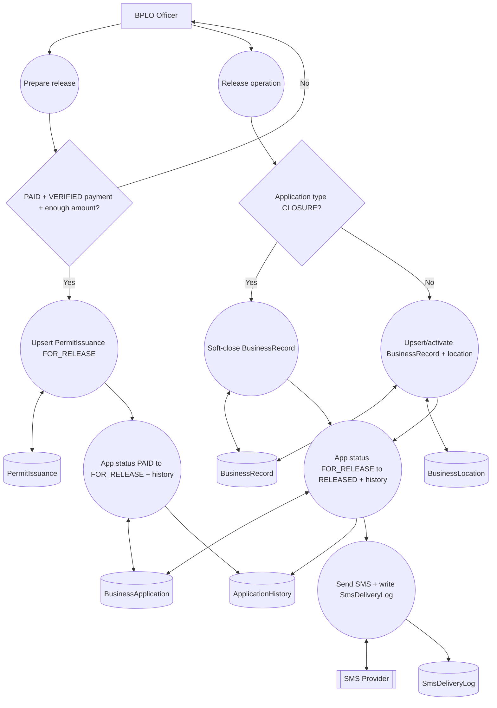

Validation and decision table

| Checkpoint | Condition | Failure behavior | Success behavior |
|---|---|---|---|
| Prepare gate | app must be PAID | Error | Continue |
| Payment gate | verified payment ref exists and amount threshold met | Error | Continue |
| Release gate | app must be FOR_RELEASE and issuance exists | Error | Continue |
| Type fork | CLOSURE uses soft-close; others use upsert active record | N/A | Continue |
| Location upsert | only if coordinates finite and inside bounds | Skip location write | Continue |

Status transition table

| From | To | Trigger |
|---|---|---|
| PAID | FOR_RELEASE | BPLO prepare permit |
| FOR_RELEASE | RELEASED | BPLO release permit |
| RELEASED (closure only effect) | CLOSED business record | soft-close business record update |

Risk notes
- Permit number generation scans existing rows then retries, which is safe in typical low concurrency but still a race window without DB sequence.
- SMS delivery failures do not block release, by design.

### Level 3-D: DH verification and revocation decision
Parent Level 2 process: Module 6.6

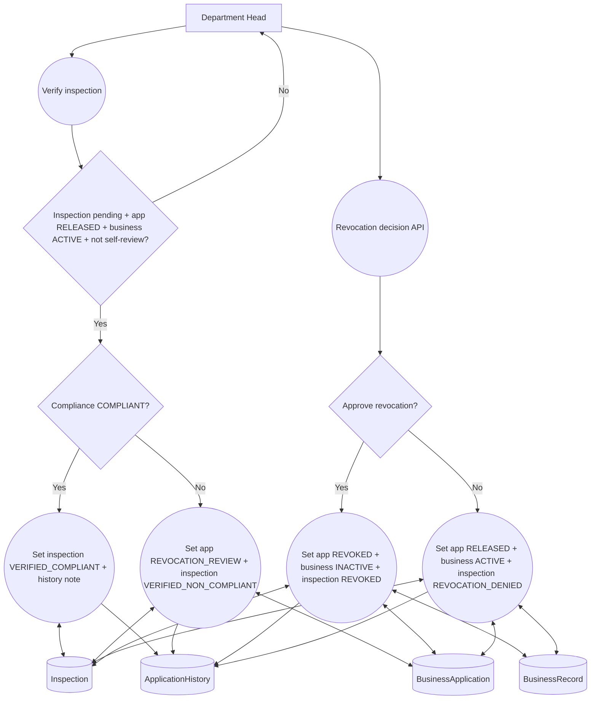

Validation and decision table

| Checkpoint | Condition | Failure behavior | Success behavior |
|---|---|---|---|
| Verification remarks | remarks required | Error | Continue |
| Stage validation | inspection must be DH_VERIFICATION_PENDING | Error | Continue |
| Ownership guard | DH cannot verify own JIT inspection | Error | Continue |
| Revocation decision guard | only verified non-compliant path, not finalized | Error | Continue |
| Decision remarks | required for approve/deny revocation | Error | Continue |

Status transition table

| From | To | Trigger |
|---|---|---|
| RELEASED | REVOCATION_REVIEW | DH verifies non-compliant inspection |
| REVOCATION_REVIEW | REVOKED | DH approves revocation |
| REVOCATION_REVIEW | RELEASED | DH denies revocation |

Risk notes
- Some audit helpers pass inspectionId as businessRecordId in revocation route metadata (traceability quality risk).
- Revocation settlement is additional step but does not modify app/business statuses; it marks inspection as settled.

## 8. Level 4 Deep-Dive DFDs

### Level 4-A: Payment verification transaction deep dive
Parent Level 3 process: Level 3-B
Implementation status: Complete

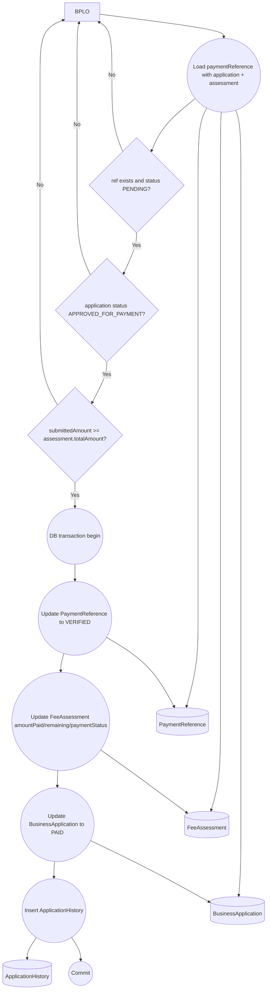

Detailed process explanation
- The approval path uses one Prisma transaction in approvePaymentReference.
- All core writes are atomic: payment ref verification, assessment financial fields, app status, history remark.

Code evidence

| File path | Function | Evidence |
|---|---|---|
| src/lib/bplo-payment-verification.ts | approvePaymentReference | Amount threshold and transactional writes |
| src/app/api/bplo/payment-verification/[paymentReferenceId]/approve/route.ts | POST | Role-gated entry and error mapping |

Data stores touched

| Store | Operation |
|---|---|
| PaymentReference | read + update |
| FeeAssessment | read + update |
| BusinessApplication | read + update |
| ApplicationHistory | insert |

Failure/success flow summary
- Failure: any checkpoint fails -> no transactional writes.
- Success: app becomes PAID and reference VERIFIED.

### Level 4-B: Applicant submit persistence boundary
Parent Level 3 process: Level 3-A
Implementation status: Partially Complete

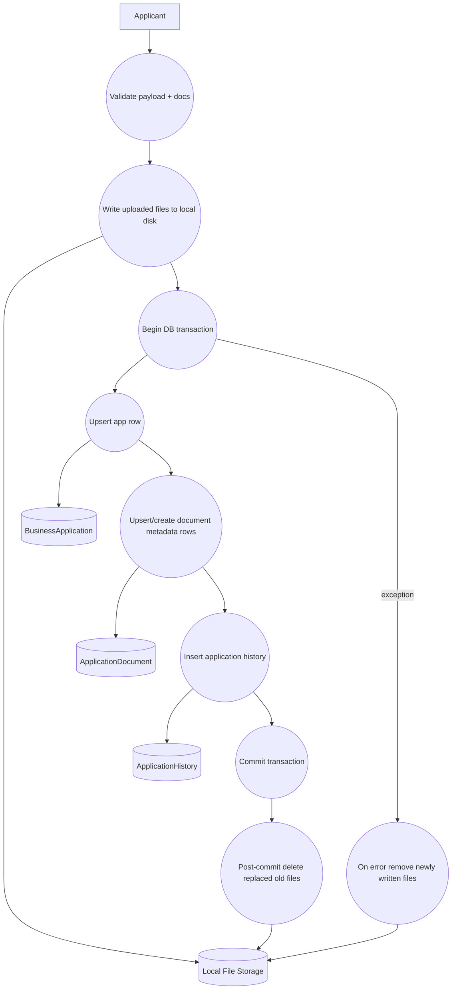

Detailed process explanation
- Files are written before DB transaction to obtain storage paths.
- DB writes are transactional.
- Error handling attempts cleanup of newly written files.

Code evidence

| File path | Function | Evidence |
|---|---|---|
| src/lib/applications.ts | saveApplicantApplication | File-first then transactional metadata approach |
| src/lib/document-storage.ts | storeApplicantDocument/removeApplicantDocument | Physical write/delete behavior |

Data stores touched

| Store | Operation |
|---|---|
| Local File Storage | create/delete files |
| BusinessApplication | create/update |
| ApplicationDocument | create/update |
| ApplicationHistory | insert |

Failure/success flow summary
- Failure: cleanup is attempted but not strictly atomic with file system.
- Success: app + docs + history persisted, files retained.

### Level 4-C: Revocation decision enforcement
Parent Level 3 process: Level 3-D
Implementation status: Complete

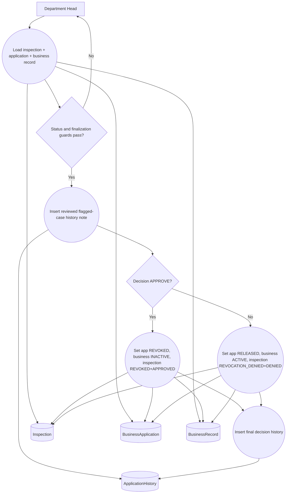

Detailed process explanation
- Enforces one-time decision (cannot finalize twice).
- Keeps app/business/inspection consistent in one transaction.
- Applies opposite restoration path when revocation is denied.

Code evidence

| File path | Function | Evidence |
|---|---|---|
| src/lib/department-head-api.ts | applyDepartmentHeadRevocationDecision | Full decision gates and transactional state updates |
| src/app/api/department-head/permit-to-revoke/[inspectionId]/approve-revocation/route.ts | POST | Approve endpoint |
| src/app/api/department-head/permit-to-revoke/[inspectionId]/deny-revocation/route.ts | POST | Deny endpoint |

Data stores touched

| Store | Operation |
|---|---|
| Inspection | read + update |
| BusinessApplication | read + update |
| BusinessRecord | update |
| ApplicationHistory | insert |

Failure/success flow summary
- Failure: guard violation returns error with no commits.
- Success: consistent final state for app, business, and inspection.

## 9. Missing, Partial, or Risky Flows

| Area | Expected data flow | Current implementation status | Evidence | Recommended fix |
|---|---|---|---|---|
| Tax payment integration | System-to-treasury or gateway verification callback and reconciliation | Not Found | src/lib/bplo-payment-verification.ts, src/app/api/applicant/top/route.ts | Add external payment reconciliation flow and immutable payment source IDs |
| File/object storage hardening | Managed storage with signed URLs/versioning/virus scanning | Partially Found | src/lib/document-storage.ts | Move uploads to managed object storage and add malware/content scanning |
| Submission atomicity across DB and file store | Strict all-or-nothing commit for metadata and binaries | Partially Found | src/lib/applications.ts | Introduce staging area and finalize files only after DB commit, or compensating job |
| Audit coverage consistency | All sensitive operations write normalized audit records | Partially Found | src/lib/audit-log.ts, src/app/api/superadmin/users/[userId]/reset-password/route.ts | Add missing audit events (ex: password reset), standardize module/action enum usage |
| Deprecated location endpoints | Single source-of-truth location write path | Partially Found | src/app/api/applicant/business-location/route.ts | Remove deprecated endpoints or hard-deprecate with explicit 410 responses |
| OR payment date provenance | Store treasury-reported payment timestamp | Partially Found | src/lib/applications.ts (submitApplicantPaymentReference) | Accept and validate authoritative payment date/source reference |
| OAuth provider availability control | Disable unused provider when env missing | Partially Found | src/lib/auth.ts | Conditionally register Google provider only when credentials are present |

## 10. Final Summary

- DFD hierarchy support level: Largely supported by current codebase for Levels 0 to 4 on critical workflows.
- Complete flows in code:
  - Authentication/session + role route guard
  - Applicant submission with validation and required document logic
  - BPLO review transitions
  - Fee computation and TOP generation
  - OR submission and BPLO verification with amount threshold
  - Permit preparation/release with business record updates
  - JIT inspection + DH verification/revocation decisions
  - Super Admin reporting/settings/audit infrastructure
- Partial flows:
  - Strong atomicity across file storage and DB writes
  - Audit consistency across all privileged actions
  - Payment ecosystem integration beyond manual OR verification
  - Legacy/deprecated location API cleanup
- Flows needing correction or hardening for production defense:
  - External payment reconciliation model
  - Storage security and scan pipeline
  - Audit normalization and coverage
  - Deprecation cleanup and contract enforcement
- Recommended diagrams for documentation/defense presentation:
  - Level 0 context diagram (stakeholder and integration overview)
  - Level 1 system decomposition (module boundaries)
  - Level 3-B (payment verification control points)
  - Level 3-C (permit release/business lifecycle)
  - Level 3-D and Level 4-C (revocation governance and enforcement)

## Required Module Presence Matrix

| Recommended module | Status | Notes |
|---|---|---|
| Authentication and role-based access | Found | Implemented via NextAuth + proxy role guard + per-route role checks |
| New application submission | Found | Applicant submit path covers NEW and validations |
| Renewal application submission | Found | Eligibility and lock rules implemented |
| Closure application submission | Found | Submission + closure-specific assessment/release path implemented |
| BPLO review and assessment | Found | Queue actions + assessment/TOP logic implemented |
| Business permit fee computation | Found | Rule tables + settings overrides implemented |
| Tax Order/payment processing | Partially Found | TOP generation and OR workflow found; no external payment gateway flow |
| Payment verification using Official Receipt Number | Found | OR uniqueness + BPLO approve/reject implemented |
| Permit release/issuance | Found | Prepare/release with business record mutations implemented |
| Document upload and secure document viewing | Found | Upload metadata/files + role-scoped download routes implemented |
| Business map/location pinning | Found | Coordinate validation, location lifecycle, BPLO/JIT map consumption implemented |
| JIT inspection workflow | Found | Evidence-required inspection flow implemented |
| Department Head verification/revocation workflow | Found | Verification + revocation decision + settlement implemented |
| Admin reporting/audit/settings workflow | Found | Reports, user mgmt, settings and audit APIs implemented |
