# EBPLS Use Case Diagram

## System Overview
The Electronic Business Permits and Licensing System (eBPLS) is a role-based platform for business permit lifecycle processing. Applicants submit and track applications, BPLO handles operational processing from review to permit release, and Superadmin manages users, monitoring, and configuration settings. The system preserves records for auditability, including closure workflows that mark businesses closed instead of deleting data.

## Actors
- Applicant: Self-service user who registers, submits business applications and requirements, tracks status, and submits payment/location details when allowed.
- BPLO: Operational processor who reviews applications, performs assessments, generates TOP, verifies payments, issues permits, and validates business locations.
- Superadmin: Administrative/configuration role for dashboards, user/account management, reports, activities, and system settings.

## Use Case Diagram

```mermaid
flowchart LR
  A[Applicant]
  B[BPLO]
  S[Superadmin]

  subgraph SYS[eBPLS System]
    direction TB

    subgraph APP[Applicant Use Cases]
      UC_A1[Register/Login]
      UC_A2[Manage Profile]
      UC_A3[Start New Application]
      UC_A4[Start Renewal Application]
      UC_A5[Start Closure Application]
      UC_A6[Submit Business Information]
      UC_A7[Upload Required Documents]
      UC_A8[View Application Status]
      UC_A9[View TOP/Payment Details]
      UC_A10[Submit Payment Reference/Proof]
      UC_A11[Submit Business Location]
      UC_A12[View Notifications]
    end

    subgraph BP[BPLO Use Cases]
      UC_B1[View Application Queue]
      UC_B2[Review Application]
      UC_B3[Mark Under Review]
      UC_B4[Return for Correction]
      UC_B5[Reject Application]
      UC_B6[Approve for Assessment]
      UC_B7[Prepare Fee Assessment]
      UC_B8[Generate TOP]
      UC_B9[Verify Payment]
      UC_B10[Reject Payment Proof]
      UC_B11[Prepare Permit]
      UC_B12[Release Permit]
      UC_B13[Verify Business Location]
      UC_B14[Return Business Location]
      UC_B15[View Reports/Profile]
    end

    subgraph SA[Superadmin Use Cases]
      UC_S1[View Dashboard]
      UC_S2[Manage Users]
      UC_S3[Manage BPLO Accounts]
      UC_S4[View Applications]
      UC_S5[View Reports]
      UC_S6[View Activities/Audit Logs]
      UC_S7[Manage Fee Settings]
      UC_S8[Manage Penalty Settings]
      UC_S9[Manage Renewal Extensions]
    end
  end

  A --> UC_A1
  A --> UC_A2
  A --> UC_A3
  A --> UC_A4
  A --> UC_A5
  A --> UC_A6
  A --> UC_A7
  A --> UC_A8
  A --> UC_A9
  A --> UC_A10
  A --> UC_A11
  A --> UC_A12

  B --> UC_B1
  B --> UC_B2
  B --> UC_B3
  B --> UC_B4
  B --> UC_B5
  B --> UC_B6
  B --> UC_B7
  B --> UC_B8
  B --> UC_B9
  B --> UC_B10
  B --> UC_B11
  B --> UC_B12
  B --> UC_B13
  B --> UC_B14
  B --> UC_B15

  S --> UC_S1
  S --> UC_S2
  S --> UC_S3
  S --> UC_S4
  S --> UC_S5
  S --> UC_S6
  S --> UC_S7
  S --> UC_S8
  S --> UC_S9
```

## Use Case Notes
- Superadmin is administrative/configuration only and is intentionally not linked to approval, assessment, payment verification, or permit release operations.
- BPLO handles operational processing across review, assessment, payment verification, and permit issuance/release.
- Applicant owns and tracks only their own applications and self-service account actions.
- Closure archives records by marking businesses closed/inactive instead of hard deleting records, preserving audit history and traceability.
- External offices (for clearances) are treated as manual/external dependencies and not modeled as system actors.

## Validation Checklist
- [ ] Only Applicant, BPLO, and Superadmin are main actors.
- [ ] Superadmin has no approval/payment/release use cases.
- [ ] BPLO has all operational processing use cases.
- [ ] Applicant use cases are self-service only.
- [ ] Closure does not imply hard delete.
- [ ] Mermaid syntax is valid.
