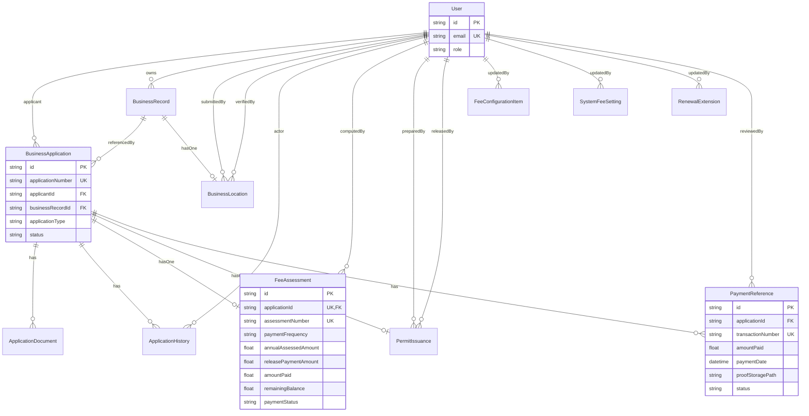

# eBPLS ERD (Based on prisma/schema.prisma)

## Models, Keys, and Constraints
- User: PK `id`; unique `email`
- BusinessRecord: PK `id`; unique `registrationNumber`; FK `applicantId -> User.id`
- BusinessLocation: PK `id`; unique `businessRecordId`; FK `submittedById -> User.id`; FK `verifiedById -> User.id`
- BusinessApplication: PK `id`; unique `applicationNumber`; FK `applicantId -> User.id`; FK `businessRecordId -> BusinessRecord.id`
- ApplicationDocument: PK `id`; FK `applicationId -> BusinessApplication.id`
- ApplicationHistory: PK `id`; FK `applicationId -> BusinessApplication.id`; FK `actorId -> User.id`
- FeeAssessment: PK `id`; unique `applicationId`; unique `assessmentNumber`; FK `computedById -> User.id`
- PaymentReference: PK `id`; unique `transactionNumber`; FK `applicationId -> BusinessApplication.id`; FK `reviewedById -> User.id`
- PermitIssuance: PK `id`; unique `applicationId`; unique `documentNumber`; FK `preparedById -> User.id`; FK `releasedById -> User.id`
- FeeConfigurationItem: PK `id`; unique `(category, classification)`; FK `updatedById -> User.id`
- SystemFeeSetting: PK `id`; FK `updatedById -> User.id`
- RenewalExtension: PK `id`; FK `updatedById -> User.id`

## Enums
- Role: APPLICANT, BPLO, SUPER_ADMIN
- ApplicationType: NEW, RENEWAL, CLOSURE
- ApplicationStatus: DRAFT, SUBMITTED, UNDER_REVIEW, ASSESSED, APPROVED_FOR_PAYMENT, PAID, FOR_RELEASE, RELEASED, RETURNED_FOR_CORRECTION, REJECTED
- BusinessLocationStatus: PENDING, VERIFIED, NEEDS_CORRECTION
- FeeAssessmentStatus: DRAFT, GENERATED
- PaymentFrequency: ANNUAL, BI_ANNUAL, QUARTERLY
- PaymentReferenceStatus: PENDING, VERIFIED, REJECTED
- PaymentSettlementStatus: UNPAID, PARTIALLY_PAID, PAID
- PermitDocumentType: BUSINESS_PERMIT, CLOSURE_CERTIFICATE
- PermitIssuanceStatus: PREPARED, FOR_RELEASE, RELEASED

## Important Fields
- FeeAssessment: `annualAssessedAmount`, `paymentFrequency`, `releasePaymentAmount`, `amountPaid`, `remainingBalance`, `paymentStatus`
- PaymentReference: `transactionNumber`, `amountPaid`, `paymentDate`, `proofFileName`, `proofStoragePath`, `status`

## Mermaid ERD

