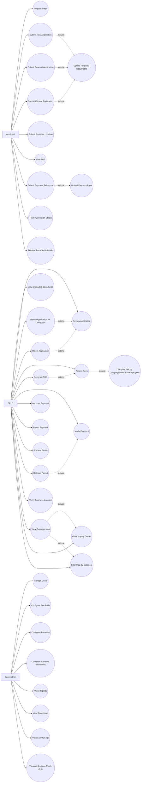

# eBPLS Use Cases

Actors
- Applicant
- BPLO
- Superadmin

## Mermaid Use Case Diagram

```mermaid
flowchart LR
  A[Applicant]
  B[BPLO]
  S[Superadmin]

  UC1((Register/Login))
  UC2((Submit New Application))
  UC3((Submit Renewal Application))
  UC4((Submit Closure Application))
  UC5((Upload Required Documents))
  UC6((Submit Business Location))
  UC7((View TOP))
  UC8((Submit Payment Reference))
  UC9((Upload Payment Proof))
  UC10((Track Application Status))
  UC11((Receive Returned Remarks))

  UC12((Review Application))
  UC13((View Uploaded Documents))
  UC14((Return Application for Correction))
  UC15((Reject Application))
  UC16((Assess Fees))
  UC17((Compute Fee by Category/Asset/Size/Employees))
  UC18((Generate TOP))
  UC19((Verify Payment))
  UC20((Approve Payment))
  UC21((Reject Payment))
  UC22((Prepare Permit))
  UC23((Release Permit))
  UC24((Verify Business Location))
  UC25((View Business Map))
  UC26((Filter Map by Owner))
  UC27((Filter Map by Category))

  UC28((Manage Users))
  UC29((Configure Fee Table))
  UC30((Configure Penalties))
  UC31((Configure Renewal Extensions))
  UC32((View Reports))
  UC33((View Dashboard))
  UC34((View Activity Logs))
  UC35((View Applications Read-Only))

  A --> UC1
  A --> UC2
  A --> UC3
  A --> UC4
  A --> UC6
  A --> UC7
  A --> UC8
  A --> UC10
  A --> UC11

  B --> UC12
  B --> UC13
  B --> UC14
  B --> UC15
  B --> UC16
  B --> UC18
  B --> UC19
  B --> UC20
  B --> UC21
  B --> UC22
  B --> UC23
  B --> UC24
  B --> UC25
  B --> UC26
  B --> UC27

  S --> UC28
  S --> UC29
  S --> UC30
  S --> UC31
  S --> UC32
  S --> UC33
  S --> UC34
  S --> UC35

  UC2 -. include .-> UC5
  UC3 -. include .-> UC5
  UC4 -. include .-> UC5
  UC8 -. include .-> UC9
  UC16 -. include .-> UC17
  UC18 -. extend .-> UC16
  UC14 -. extend .-> UC12
  UC15 -. extend .-> UC12
  UC23 -. include .-> UC19
  UC25 -. include .-> UC26
  UC25 -. include .-> UC27
```
